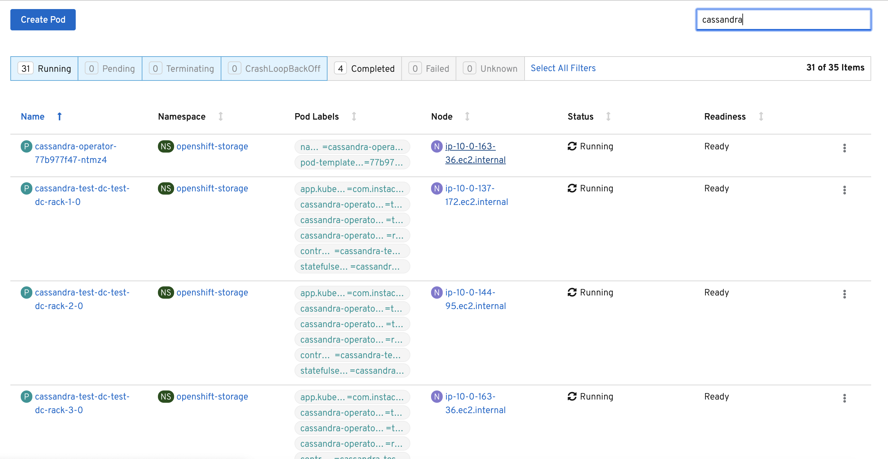
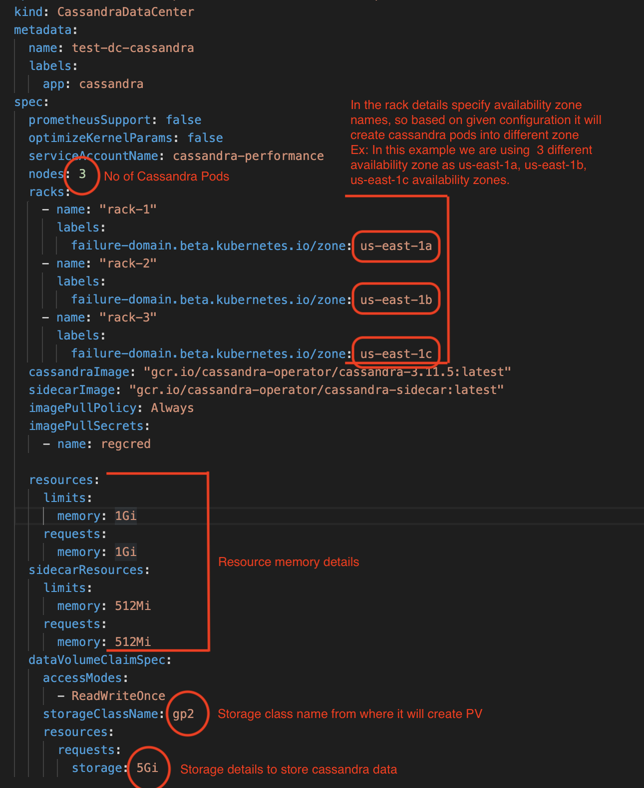

# Deploy Instaclustr Cassandra in Openshift

This page will help you to deploy instaclustr cassandra into your openshift cluster. We are assumming you already have openshift cluster admin access. 

## Steps to deploy Cassandra on Openshift  

#### Step1: Clone this repo. 
```bash
git clone -b openshift --single-branch https://github.com/rajusem/cassandra-operator.git
```

#### Step2: Go to deploy folder 
```bash
cd cassandra-operator/deploy/openshift
```

#### Step3: Configure few variables in env.sh file
Open env.sh file available into present folder and update below mentioned variables based on Openshift Cluster details and namespace you wanted to use. 
```bash
export OC_TOKEN='<Token to login into Openshift Cluster>'
export OC_URI='<Openshift server url with port 6443 Ex: https://test.xyz.com:6443>'
export AVALIBILITY_ZONE='<Openshift Node/Worker availaibity zone Ex: us-east-1>'
export NAMESPACE='<Namespace under which you want to deploy cassandra>'
export STORAGE_CLASS_NAME='<Storage class from where cassandra will get PV Ex: gp2/ocs-storagecluster-ceph-rbd>'
```
OC_TOKEN/OC_URI: You can get token and url from ther openshift cluster. Login  into openshift cluster, click on your login name on top right corner, click on 'Copy Login Command'
AVALIBILITY_ZONE: While creating cluster you should have specified availaibility zone where it creates worker node, specify that here. 
NAMESPACE: Project/Namespace name  under whihc you want to deploy cassandra pods. 
STORAGE_CLASS_NAME: Storage class from where cassandra will get memory in form of PV/PVC

#### Step4: Run deployment script
Now we are all set to deploy cassandra on openshift cluster. Run below command.  
```bash
./deploy.sh
```

#### Step5: Watch the logs 
It may take 5-10 minutes based on cluster size/network/availibity zone etc. Once successfully deployed you can see below log into your terminal 
```bash
cassandra deployed successfully
```

#### Step6: Verify deployment


Option 1. 
<br/>
You can open openshift UI and go to namespace that you have given and check cassandra pod created or not, and it should be in running state. 


Option 2.
<br/>
Run below comamnd to get available keyspaces in cassandra.
```bash
kubectl exec cassandra-test-dc-test-dc-rack-1-0 -c cassandra -- cqlsh -e "describe keyspaces;" cassandra-test-dc-test-dc-nodes 
```

Note: 'cassandra-test-dc-test-dc-rack-1-0' is the pod name and 'cassandra-test-dc-test-dc-nodes' is the service name.


## Cassandra Configuration if you want, you can change. 

 

 Nodes: It tells system how many no of cassandra pods you want to create. Based on this configuration you need to specify 'racks' details. 
 Availibility Zone: Based on worker availibility zone you can specify zone details. 
 Resources: you can specify memory/cpu configuration in this section 
 Storage Class Name: Its used for getting Persistance Volumn
 Storage : space needs to allocate to each cassandra pods. 